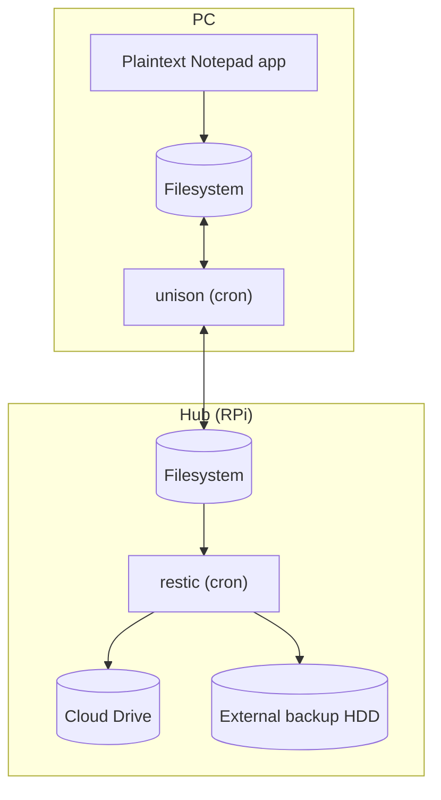

notesync-unison

# What?

Sync and backup plain text notes.

[`restic`](https://restic.net/) +
[`unison`](https://github.com/bcpierce00/unison) approach to backup and
synchronize plain text files (notes, journals, etc.) between multiple machines,
probably also Android phones in the future. Key facts:

- using star topology: there is a central hub which works as a broker, peers
  never talk with each other directly
- hub (e.g. RaspberryPI) performs incremental, periodic backups
- peers can schedule their own syncing routines, currently using simple
  `systemd.timer` (cron) periodic schedule, but can be switched to path
  monitoring (see `man systemd.path`)

  In the diagram below you can find the data flow.

